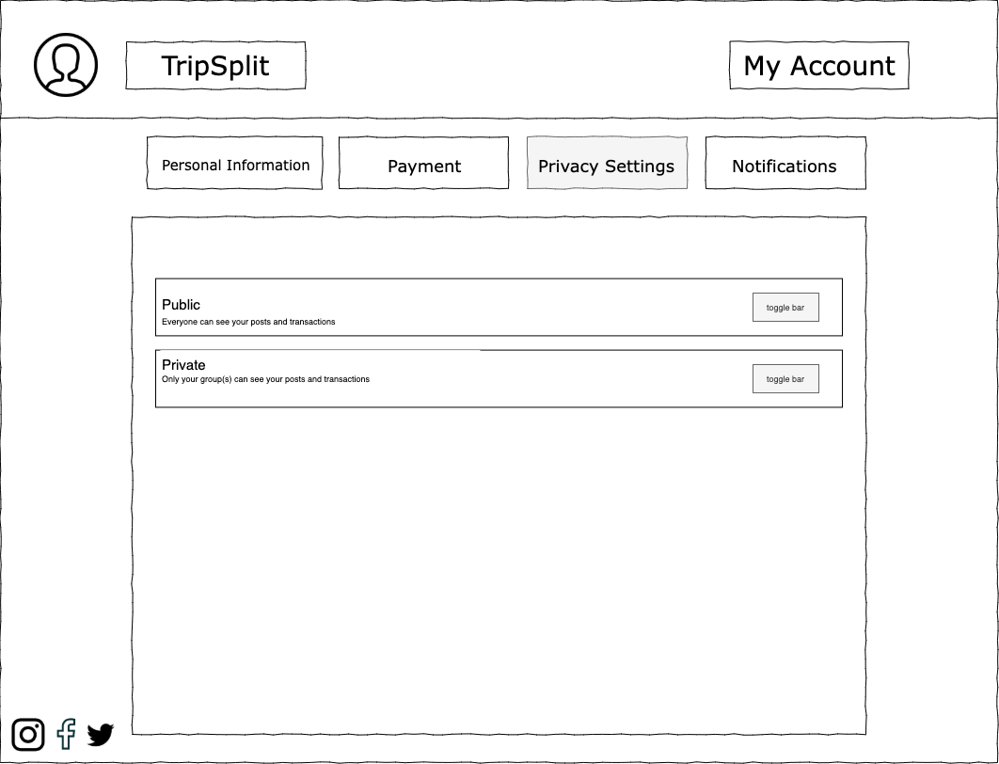

# User Experience Design

## App Map 
Below is the app map for TripSplit. The home page has a summary of the current group and buttons to create a group, friends, account, and all groups. Create a group page allows the user to create a new group. Friends allows the user to view your friends and add new frineds, as well as add specific friends to groups and charge specific friends. Account allows the user to view your account information. Finally, all groups allows the user to view the past groups they were apart of and all of the past transactions within that group. Further description about each page is below. 

## Wireframes 

### Homescreen 

### Current Group 
Clicking the arrow button on the home screen brings you to a new page with more detailed information about the current group. Including access to all transactions and information regarding how much money you owe to who and who owes you money. 

Pop ups on Current Group: 
1. Who you owe 

2. You are owed

3. See members

4. Add Expense 

5. Settle up 

### Create A Group 

### All Groups 

### Friends

Pop ups on friends: 

1. Add a Friend 

2. Charge a friend 

3. Add friend to a group 

### Account

Tabs on Account: 
1.  Privacy Settings

2. Payments

3. Notifications

